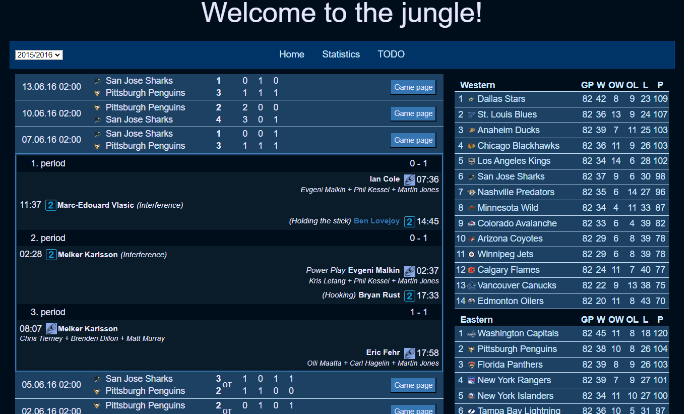

# NHLApp

Dynamic web project written in Java using data from Oracle db, that are loaded from api (NHLDataLoader repository), showing them in a html pages. 

## Technologies:
Java, Oracle, Html, Javascript, CSS  

- Web requests are serviced by Java servlets  
- Data are retrieved from database using JDBC and ordinary SQL queries (webapp/sources/sql folder)  
- For outputting data I use simple class Tag (com.nhl.output.Tag.java for reference) that allows to write tags in more object-oriented way and prevents headaches caused by writing html as String - eventually rewrite in TypeScript is innevitable but for now Tag class works pretty well.  
Example of writing html table header using Tag.java:
https://github.com/Tomas-Mas/NHLApp/blob/2d3db45d0cadb1ebfb297bb2b8f035caa58fb7d9/src/main/java/com/nhl/output/RegulationStatistics.java#L130-L141

- Combination of CSS and Javascript for style and some interactive functions

## Pages

#### Main Page

#### Stats Page

#### TODO
Player page, team page, game page
